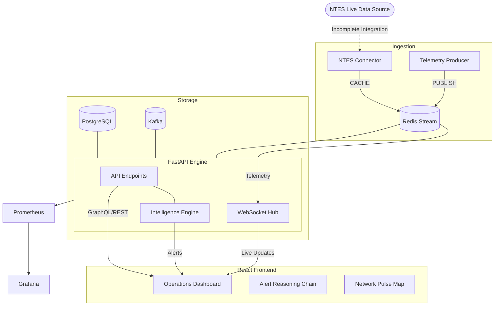

# DRISHTI: System Architecture Review & Technical Documentation

**Reviewer:** Senior Systems Architect  
**Status:** Deep Audit / Pre-Production Review  
**Date:** April 5, 2026

---

## 1. System Overview

DRISHTI is an advanced Railway Safety and Intelligence platform designed to predict and mitigate risks across the Indian Railway network. By leveraging real-time telemetry, historical accident signatures, and causal reasoning models, the system aims to provide a 30-60 minute predictive window for potential incidents.

### Core Features
- **National Scale Monitoring**: Tracking ~9000 trains with low-latency updates.
- **Multi-Model Intelligence**: Combining anomaly detection (Isolation Forest), risk propagation (Causal DAG), and temporal forecasting (LSTM).
- **Unified Alert Reasoning**: High-fidelity explanations for every risk event, detailing the exact evidence chain.
- **Operations Dashboard**: Real-time visualization of network stress, junctions, and train trajectories.
- **Audit Compliance**: Cryptographically signed event logs for legal and operational accountability.

---

## 2. Architecture Breakdown

The system employs a containerized micro-modular architecture, ensuring separation of concerns between data ingestion, AI inference, and user visualization.

### Component Interaction
1.  **Frontend (React/Vite)**: A high-performance SPA using Leaflet for geospatial mapping and D3 for network graph visualization. Communicates via REST APIs and WebSockets.
2.  **Backend (FastAPI)**: An asynchronous Python hub handling business logic, WebSocket broadcasting, and ML inference orchestration.
3.  **Telemetry Producer (Python)**: A background service generating/ingesting train physics into a Redis-backed stream.
4.  **Database Layer**:
    *   **PostgreSQL**: Persistence for audits, user data, and station metadata.
    *   **Redis**: In-memory message broker for high-speed streaming and feature storage.
    *   **Kafka/Zookeeper**: Enterprise-grade event bus for decoupling high-volume data ingestion.
5.  **Monitoring Stack**: Prometheus collects system metrics, which are visualized via Grafana dashboards.

### Architecture Diagram (Mermaid)

---

## 3. Data Flow & Processing

### The Pipeline
1.  **Source**: Data is either simulated (via `telemetry_producer.py`) or partially polled from NTES.
2.  **Ingestion**: Records are pushed to a Redis stream (`STREAMING_BACKEND: redis`).
3.  **Validation**: `NTESConnector` verifies coordinates (India bounds) and delay ranges (<8 hrs).
4.  **Cleaning/Transformation**: Raw JSON is normalized into SQLAlchemy models (`TrainTelemetry`).
5.  **Intelligence Loop**: 
    - Feature extraction (Delay, Night, Loop Line, Maintenance).
    - Inference via Isolation Forest.
    - Causal propagation via NetworkX DAG.
6.  **Storage**: Validated telemetry and alerts are persisted to PostgreSQL for long-term audit.

> [!CAUTION]
> **Data Flow Risk**: The `NTESConnector` is currently a skeletal mock. The system's "National Scale" claims are dependent on a production-ready scraping/API layer that is currently unimplemented.

---

## 4. Backend Design

The backend is built on **FastAPI**, prioritizing performance and type safety.

### Implementation Patterns
- **Asynchronous Operations**: Using `asyncio` for the WebSocket relay and API handlers.
- **Repository Pattern (Partial)**: Data access is abstracted through SQLAlchemy sessions injected into routes.
- **Real-time Broadcasting**: A `while True` loop in the WebSocket hub pushes telemetry every 2 seconds.

### Critical Critique: Scalability & Design
- **State Management**: Using `deque(maxlen=500)` for the `alert_buffer` is an anti-pattern for scaled production. If the API scales to multiple instances, each will have a different (incomplete) buffer. **State must be moved to Redis Sorted Sets.**
- **Blocking Tasks**: Heavy ML inference (Isolation Forest training/fit) currently happens in-process. This risks blocking the FastAPI event loop. These should be moved to background workers (e.g., Celery).

---

## 5. AI/ML Pipeline

### Model Review
1.  **Isolation Forest (Scikit-learn)**: Detects deviations from "normal" operating signatures. 
    - *Input*: [delay, goods_train, night, loop_line, maintenance].
    - *Training*: Based on `crs_corpus.json` (6 historical accidents) and 5000 synthetic records.
2.  **Causal DAG (NetworkX)**: Models the Indian Railway network as a directed acyclic graph to predict risk propagation.
3.  **Bayesian Networks**: Probabilistic inference for cascade likelihood.

### Technical Flaws
- **Training Set Poverty**: Training an Isolation Forest on only 6 real-world accidents is statistically insignificant for a system of this scope. It likely suffers from high false-positive rates or fails to generalize to regional variations (e.g., fog in the North vs. Ghat sections in the South).
- **Feature Reductions**: The feature set is too narrow. It ignores speed, weather, locomotive health (telemetry), and crew hours.

---

## 6. DevOps & Deployment

### Infrastructure
- **Containerization**: 7-service `docker-compose` stack (Redis, Kafka, Zookeeper, Postgres, Prometheus, Grafana, API).
- **Orchestration**: Kubernetes manifests provided for production (`deployment/kubernetes-production.yml`).
- **Monitoring**: Deep integration with Prometheus. Grafana dashboards are provisioned dynamically for operational visibility.

### Bottlenecks
- **PostgreSQL Ingestion**: Writing raw telemetry from 9000 trains directly to Postgres will hit I/O limits rapidly.
- **Suggestion**: Use **TimescaleDB** for telemetry and Postgres only for relational audit logs.

---

## 7. Design Decisions & Trade-offs

- **Choice: Redis over Kafka for primary streaming.**
  - *Pro*: Complexity for development is lower; <1ms latency.
  - *Con*: Less durability if the stream isn't immediately persisted.
- **Choice: Isolation Forest (Unsupervised) over Supervised Learning.**
  - *Pro*: Doesn't require perfectly labeled "accident" data for every possible scenario.
  - *Con*: Hard to interpret intermediate states.

---

## 8. Performance & Bottlenecks

1.  **Telemetry Relay**: The current 2-second sleep in the WebSocket hub is a "coarse-grained" update. Performance will degrade under high node counts (>5000 nodes).
2.  **Inference Latency**: The `CRSIntelligenceEngine` retrains or processes signatures synchronously. National-scale inference requires a dedicated ML inference server (e.g., NVIDIA Triton or TorchServe).

---

## 9. Security Considerations

> [!WARNING]
> **Critical Security Audit Findings**
> 1. **Credential Exposure**: Passwords for Postgres and Grafana are hardcoded in `docker-compose.yml`.
> 2. **CORS Vulnerability**: `CORSMiddleware` is configured with `allow_origins=["*"]`. This must be restricted to the production frontend domain.
> 3. **Raw Data Exposure**: The `raw_payload` field in the database stores potentially sensitive telemetry metadata unencrypted.

---

## 10. Suggestions & Improvements

### Production-Grade Roadmap
1.  **Robust Data Ingestion**: Transition from synthetic producers to a hardened, distributed NTES scraping cluster with automated reconciliation.
2.  **Distributed State**: Move `alert_buffer` and station "stress levels" into Redis.
3.  **Explainability 2.0**: The "reasoning" is currently hardcoded in the API. Move to a dynamic explanation engine that parses the ML decision path.
4.  **Network-Wide GNN**: Implement a **Graph Neural Network** to capture spatial dependencies across the network topology more effectively than simple DAGs.
5.  **Secret Management**: Implement HashiCorp Vault or AWS Secrets Manager for all environment variables.

---

**Summary Assessment:** DRISHTI is an impressively structured architectural vision with a world-class UI. However, the "Intelligence" layer is currently a high-fidelity prototype (mocked/simulated) rather than a production-grade inference engine. Significant engineering effort is required to bridge the gap between this prototype and a mission-critical safety system.
